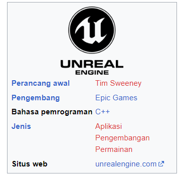

# Unreal Engine

#
#
**Unreal Engine** adalah sebuah aplikasi pengembangan permainan(game engine) yang di buat oleh Epic Gemes, memulai debutnya pada 1998, dengan permaianan bertema tembak-menembak orang-pertama(FPS). Walau pada awalnya di buat untuk permainana bertema itu saja, aplikasi ini mampu digunakan oleh pengembang dalam berbagai jenis genre permainan seperti; permainan berbunyi( *stealth* ), permainan pertempuran (*fighting games*), permainan peran daring multipemain masif(MMORPG), hingga beberapa permainan peran (RPG). Dengan kode pemrograman yang ditulis dalam C++, aplikasi ini mampu memberikan kemudahan portabilitas yang tinggi serta merupakan aplikasi yang kerap digunakan di berbagai pengembangan permainan video(Video Game) hingga kini. Contoh permaninan yang dibuat menggunakan Unreal Engine meliputi PUBG, BioShock, Gear Of War 3, Boderlands 2, dan Batman : Arkham City.

**SUMBER** :*[Wikipedia](https://id.wikipedia.org/wiki/Unreal_Engine)*