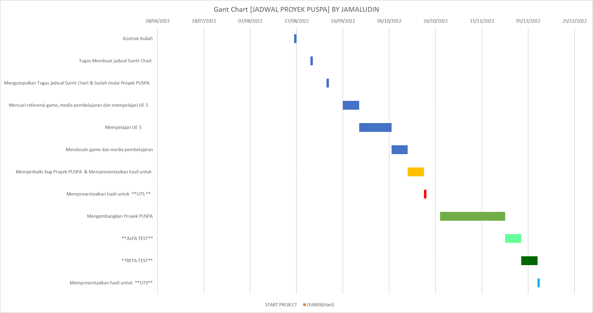

#Gant Chart [JADWAL PROYEK PUSPA] BY JAMALUDIN
#
#

##### NOTE : YANG BOLD KEMUNGKINAN UTS & UAS

|No. |      Tanggal       |                                     Aktivitas                                      |
|----|--------------------|------------------------------------------------------------------------------------| 
| 1. |26 Agustus 2022     |  Kontrak Kuliah                                                                    |
| 2. | 02 September 2022  |  Tugas Membuat jadwal Gantt Chart                                                  |
| 3. | 09 September 2022  |  Mengumpulkan Tugas jadwal Gantt Chart & Sudah mulai Proyek PUSPA                  |
| 4. | 16 September 2022  |  Mencari referensi game, media pembelajaran dan mempelajari UE5                                                                                                            |
| 5. | 23 September 2022  |  Mempelajari UE 5                                                                  |
| 6. | 30 September 2022  |  Mempelajari UE                                                                    |
| 7. | 07 Oktober 2022    |  Mendesain game dan media pembelajaran                                             |
| 8. | **14 Oktober 2022**|  Memperbaiki bug Proyek PUSPA  & Mempresentasikan hasil untuk **UTS**                                                                                                        |
| 9. | **21 Oktober 2022**|  Mempresentasikan hasil untuk **UTS**                                                                                                        |
| 10. | 28 Oktober 2022   |  Mengembangkan Proyek PUSPA                                                        |
| 11. | 04 November 2022  |  Mengembangkan Proyek PUSPA                                                        |
| 12. | 11 November 2022  |  Mengembangkan Proyek PUSPA                                                        |
| 13. | 18 November 2022  |  Mengembangkan Proyek PUSPA                                                        |
| 14. | 25 November 2022  |   **ALPA TEST**                                                                    |
| 15. | 02 Desember 2022  |   **BETA TEST**                                                                    |
| 16. | **09 Desember 2022**|Mempresentasikan hasil untuk **UTS**                                                                                                        |

